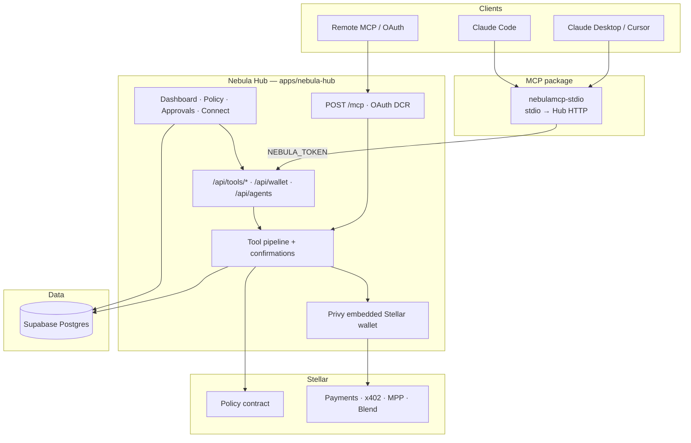

# Nebula

**A Stellar wallet for AI agents** — custody, policy, and payments so agents can spend USDC on-chain without ever holding a private key.

[Production](https://nebulaonchain.xyz)

---

## Table of contents

- [Overview](#overview)
- [Architecture](#architecture)
- [Monorepo](#monorepo)
- [Quick start](#quick-start)
- [Configuration](#configuration)
- [Connect an agent (MCP)](#connect-an-agent-mcp)
- [What agents can do](#what-agents-can-do)
- [Partners](#partners)
- [Documentation](#documentation)
- [Contributing](#contributing)
- [License](#license)

---

## Overview

Agents can already plan and call tools — they still stop at paywalls. Nebula gives each agent a **bounded Stellar wallet**: inline USDC payments (x402), session budgets (MPP), DeFi hooks (Blend), and spend limits the agent cannot bypass.

Private keys never leave the Hub. Agents and MCP clients only present a `nbl_live_…` token (or OAuth). The Hub enforces policy, confirms transfers when required, signs with Privy custody, and submits to Stellar — the agent only expresses intent.

- **Custody** — Privy-managed Stellar wallets, one per agent, isolated from each other and the owner.
- **Policy** — per-transaction / daily / per-category USDC caps, allow/deny lists, and an emergency pause, enforced in Postgres and (optionally) on-chain via a Soroban contract.
- **Payments** — classic transfers, XLM ↔ USDC swaps, x402 pay-walled HTTP, and MPP payment channels.
- **Treasury** — Blend auto-yield with a configurable liquid band.
- **Reputation** — Stellar8004-backed on-chain agent identity and score.

---

## Architecture




| Layer                                    | Role                                                                                |
| ---------------------------------------- | ----------------------------------------------------------------------------------- |
| **Hub** (`apps/nebula-hub`)              | Next.js app: Privy auth + custody, dashboard, tool APIs, remote Streamable HTTP MCP |
| `nebulamcp-core`                         | Shared Zod tool schemas + confirmation / policy matrix                              |
| `nebulamcp-stdio`                        | Thin stdio MCP client → Hub (`npx nebulamcp-stdio`)                                 |
| **Landing** (`apps/landing`)             | Marketing site; built into Hub `public/landing` for deploy                          |
| **Policy contract** (`contracts/policy`) | On-chain spend caps / treasury bands when `POLICY_CONTRACT_ID` is set               |


Full phase status and stack map: [docs/ARCHITECTURE.md](docs/ARCHITECTURE.md).

---

## Monorepo

```
nebula/
├── apps/
│   ├── nebula-hub/          # Custody Hub (dashboard + APIs + /mcp)
│   └── landing/             # Marketing site → hub public/landing
├── packages/
│   ├── nebulamcp-core/      # nebulamcp-core (shared schemas)
│   └── nebulamcp/           # nebulamcp-stdio  (bin: nebulamcp)
├── contracts/policy/        # Soroban policy contract
└── docs/                    # Architecture, structure, setup guides
```

Layout details: [docs/STRUCTURE.md](docs/STRUCTURE.md).

---

## Quick start

**Prerequisites:** Node 18+, [pnpm](https://pnpm.io) 10+, and a Supabase Postgres database.

```bash
pnpm install

# Hub locally (needs apps/nebula-hub/.env.local — copy from .env.example)
pnpm --filter nebulamcp-core build
pnpm --filter nebula-hub dev          # → http://localhost:3000

# Optional: marketing site alone
pnpm --filter nebulamcp-core build && pnpm --filter nebula-landing build
pnpm --filter nebula-landing preview
```

---

## Configuration

**Env template:** `[apps/nebula-hub/.env.example](apps/nebula-hub/.env.example)` — copy to `apps/nebula-hub/.env.local`.

**Database:** Supabase Postgres — see [docs/SUPABASE.md](docs/SUPABASE.md). Apply `apps/nebula-hub/supabase/hub.sql`.

Minimum for a working Hub:


| Group          | Variables                                                                                         |
| -------------- | ------------------------------------------------------------------------------------------------- |
| Database       | `DATABASE_URL`, `DIRECT_URL`                                                                      |
| Privy custody  | `NEXT_PUBLIC_PRIVY_APP_ID`, `PRIVY_APP_ID`, `PRIVY_APP_SECRET`, `PRIVY_AUTHORIZATION_PRIVATE_KEY` |
| App origin     | `NEXT_PUBLIC_APP_URL`, `APP_BASE_URL`                                                             |
| Wallet sign-in | `WALLET_SESSION_SECRET` (HMAC for Freighter/EOA SIWS — required in production)                    |


Optional: `POLICY_CONTRACT_ID` (on-chain caps), `TAEL_PARTNER_SIGN_URL` / `TAEL_HMAC_SECRET` (partner signing), Upstash Redis (rate limits). The template documents every variable.

---

## Connect an agent (MCP)

1. Sign in at [nebulaonchain.xyz](https://nebulaonchain.xyz) → **Connect** → create an agent → copy its `nbl_live_…` token.
2. Pick a path below. Prefer the **www** Hub host so Bearer tokens survive redirects.

> **Never put a Stellar secret key in MCP config** — only `NEBULA_TOKEN`.


### npm package (Claude Desktop / Cursor)

Published: `[nebulamcp-stdio](https://www.npmjs.com/package/nebulamcp-stdio)` (depends on `[nebulamcp-core](https://www.npmjs.com/package/nebulamcp-core)`). Use this when the client only speaks **local stdio MCP** — it runs `npx` and forwards tools to the Hub. You do **not** need it for Claude Code or custom agents that can call HTTP.

```json
{
  "mcpServers": {
    "nebula": {
      "command": "npx",
      "args": ["-y", "nebulamcp-stdio"],
      "env": {
        "NEBULA_TOKEN": "nbl_live_…",
        "NEBULA_HUB": "https://www.nebulaonchain.xyz"
      }
    }
  }
}
```

Package docs: [packages/nebulamcp/README.md](packages/nebulamcp/README.md).

### Remote HTTP (Claude Code / custom agents)

No npm install — point the client at Hub Streamable HTTP:

```
POST https://www.nebulaonchain.xyz/mcp
Authorization: Bearer nbl_live_…
```

Claude Code:

```bash
claude mcp add --transport http nebula https://www.nebulaonchain.xyz/mcp \
  -s user \
  --header "Authorization: Bearer nbl_live_…"
```

OAuth DCR for hosted connectors is also on the Hub (`/api/oauth/register` → `/authorize` → `/oauth/token`). More: [docs/MCP-DEV.md](docs/MCP-DEV.md).

---

## What agents can do


| Capability    | Tools / surface                                                  |
| ------------- | ---------------------------------------------------------------- |
| Wallet        | Balances, identity, fund (testnet), transfer                     |
| Swap          | XLM ↔ Circle USDC on Stellar DEX (`get_swap_quote`, `swap`)      |
| Policy        | Caps, allow/deny lists; on-chain when policy contract configured |
| Confirmations | Human approve flow + `await_confirmation`                        |
| x402          | Pay-walled HTTP via Stellar USDC                                 |
| MPP           | Open session → fetch → close / settle                            |
| Treasury      | Blend XLM deposit/withdraw, auto-yield on activity               |
| Reputation    | Stellar8004-backed agent reputation (Hub-provisioned)            |


---

## Partners

**[Tael Protocol](https://taelprotocol.xyz/)** — Nebula's capabilities are listed on Tael so Tael agents can discover and call them, paying per call in USDC on Stellar. Read-only capabilities are live; agent-spend signing (Tael card via `partner_callback`) is rolling out next.

---


## Documentation


| Doc                                                | Contents                               |
| -------------------------------------------------- | -------------------------------------- |
| [ARCHITECTURE.md](docs/ARCHITECTURE.md)            | Phase status, stack map                |
| [STRUCTURE.md](docs/STRUCTURE.md)                  | Repo layout                            |
| [SUPABASE.md](docs/SUPABASE.md)                    | Database setup                         |
| [MCP-DEV.md](docs/MCP-DEV.md)                      | MCP testing (x402, MPP, confirmations) |
| [contracts/policy](contracts/policy/README.md)     | Soroban policy contract API + deploy   |
| [packages/nebulamcp](packages/nebulamcp/README.md) | stdio MCP client                       |


---


## Contributing

This is a pnpm workspace. Before opening a PR:

```bash
pnpm --filter nebula-hub run typecheck   # tsc --noEmit
pnpm --filter nebula-hub run build        # prisma generate + next build
```

Keep private keys and `.env.local` out of commits (only `.env.example` is tracked).

---


## License

[MIT](LICENSE)