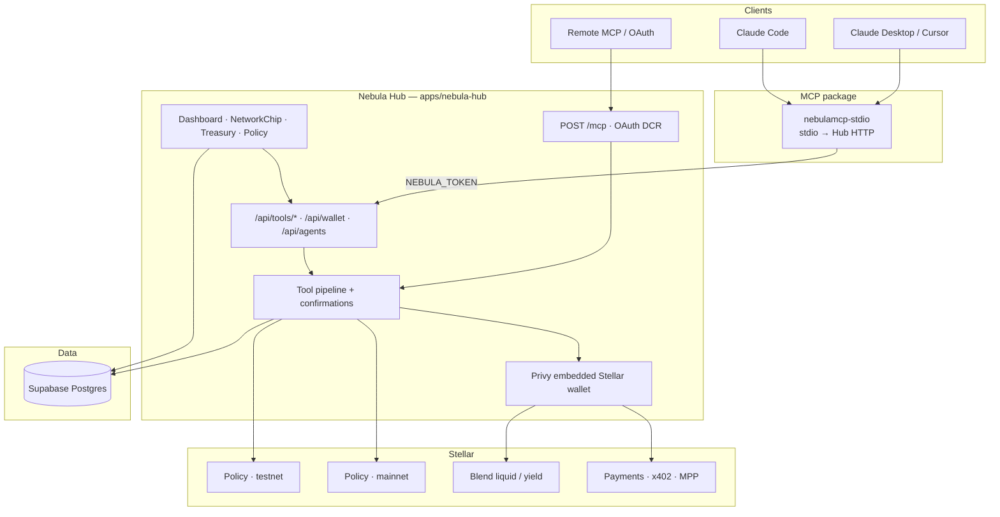

# Nebula

**Treasury infrastructure for AI agents on Stellar** — custody, policy, liquid/yield split, and payment rails so an agent can hold and move capital without holding a private key.

[Production](https://nebulaonchain.xyz)

---

## Table of contents

- [Overview](#overview)
- [Architecture](#architecture)
- [Networks (testnet / mainnet)](#networks-testnet--mainnet)
- [Monorepo](#monorepo)
- [Quick start](#quick-start)
- [Configuration](#configuration)
- [Connect an agent (MCP)](#connect-an-agent-mcp)
- [What agents can do](#what-agents-can-do)
- [Partners](#partners)
- [Documentation](#documentation)
- [Contributing](#contributing)
- [License](#license)

---

## Overview

Agents can plan and call tools; they still need a place for capital to live, earn, and leave under bounds. Nebula is that **treasury layer**: each agent gets an isolated Stellar wallet, a liquid band for spend, optional Blend yield on idle funds, and an on-chain policy ledger the Hub enforces before it signs spend.

Private keys never leave the Hub. Agents and MCP clients only present a `nbl_live_…` token (or OAuth). The Hub enforces policy, confirms when required, signs with Privy custody, and submits to Stellar — the agent only expresses intent.

- **Custody** — Privy-managed Stellar wallets, one per agent, isolated from each other and the owner.
- **Twin ledgers** — testnet and mainnet are fully separate agent sets (wallets, policy, history, MCP scope). Switch with the dashboard NetworkChip.
- **Treasury** — liquid band + Blend auto-yield: keep enough spendable, park the rest (XLM on testnet; XLM + USDC pools on mainnet).
- **Policy** — per-transaction / daily / per-category USDC caps, allow/deny lists, emergency pause — Postgres and on-chain via Soroban when a network’s policy contract id is set.
- **Payment rails** — transfers, XLM ↔ USDC swaps, x402 pay-walled HTTP, MPP session channels — spend from the treasury, not a separate wallet product.
- **Reputation** — Stellar8004-backed on-chain agent identity and score.

---

## Architecture


```mermaid
flowchart TB
  subgraph clients [Clients]
    CD[Claude Desktop / Cursor]
    CC[Claude Code]
    RM[Remote MCP / OAuth]
  end

  subgraph npm [MCP package]
    STDIO["nebulamcp-stdio<br/>stdio → Hub HTTP"]
  end

  subgraph hub [Nebula Hub — apps/nebula-hub]
    UI[Dashboard · NetworkChip · Treasury · Policy]
    API["/api/tools/* · /api/wallet · /api/agents"]
    MCP["POST /mcp · OAuth DCR"]
    PIPE[Tool pipeline + confirmations]
    PRIVY[Privy embedded Stellar wallet]
  end

  subgraph chain [Stellar]
    POLT[Policy · testnet]
    POLM[Policy · mainnet]
    TREAS[Blend liquid / yield]
    NET[Payments · x402 · MPP]
  end

  subgraph data [Data]
    SB[(Supabase Postgres)]
  end

  CD --> STDIO
  CC --> STDIO
  STDIO -->|"NEBULA_TOKEN"| API
  RM --> MCP
  MCP --> PIPE
  API --> PIPE
  UI --> API
  PIPE --> PRIVY
  PIPE --> POLT
  PIPE --> POLM
  PRIVY --> TREAS
  PRIVY --> NET
  PIPE --> SB
  UI --> SB
```

| Layer | Role |
| ----- | ---- |
| **Hub** (`apps/nebula-hub`) | Next.js app: Privy auth + custody, treasury/policy UI, tool APIs, remote Streamable HTTP MCP |
| `nebulamcp-core` | Shared Zod tool schemas + confirmation / policy matrix |
| `nebulamcp-stdio` | Thin stdio MCP client → Hub (`npx nebulamcp-stdio`) |
| **Landing** (`apps/landing`) | Marketing site; built into Hub `public/landing` for deploy |
| **Policy contract** (`contracts/policy`) | Shared multi-tenant Soroban policy; **one deploy per ledger** (`POLICY_CONTRACT_ID_TESTNET` / `_MAINNET`) |

Full phase status and stack map: [docs/ARCHITECTURE.md](docs/ARCHITECTURE.md).

---

## Networks (testnet / mainnet)

Production Hub is **split by subdomain** (separate logins, same DB):

| Host | Ledger |
| ---- | ------ |
| [testnet.nebulaonchain.xyz](https://testnet.nebulaonchain.xyz) | Testnet (default product entry) |
| [mainnet.nebulaonchain.xyz](https://mainnet.nebulaonchain.xyz) | Mainnet |
| [nebulaonchain.xyz](https://nebulaonchain.xyz) `/` | Marketing landing |
| apex/www product routes (`/login`, `/agents`, …) | 308 → testnet.* |

The dashboard **NetworkChip** navigates to the other host (you sign in again). Agents, policy, treasury, and history stay twin-scoped by `network` in the DB.

| | Testnet | Mainnet |
| - | ------- | ------- |
| Agents | Own rows + Privy wallets | Separate twin agents (not auto-cloned) |
| Policy / treasury / history | Scoped to `network=testnet` | Scoped to `network=mainnet` |
| On-chain policy | `CAWKC7IEHVKM5V5JVXJE4HNWCM5CHZZHFYH33W5O7EEEQIND6TJ3CD2F` | `CCPXPACO3V2FISPN5CY5LGFSU7XI5QBVMHOC25ITJVTCIF2P3OCNILWU` |
| Blend | TestnetV2 (XLM) | Fixed + YieldBlox (XLM + USDC) |
| Fianza / TrustLine credit | Available | Not enabled until Fianza pubnet API |

MCP tokens bound to an agent always use **that agent’s ledger**. Point `NEBULA_HUB` at the host where you minted the token.

Deploy notes and invoke examples: [contracts/policy/README.md](contracts/policy/README.md). Schema backfill SQL: `apps/nebula-hub/prisma/sql/20260725_network_isolation.sql`.

**Ops:** add both subdomains on the Vercel Hub project; allowlist both origins in Privy.

---

## Monorepo

```
nebula/
├── apps/
│   ├── nebula-hub/          # Custody + treasury Hub (dashboard + APIs + /mcp)
│   └── landing/             # Marketing site → hub public/landing
├── packages/
│   ├── nebulamcp-core/      # nebulamcp-core (shared schemas)
│   └── nebulamcp/           # nebulamcp-stdio  (bin: nebulamcp)
├── contracts/policy/        # Soroban policy + treasury-band contract
└── docs/                    # Architecture, structure, setup guides
```

Layout details: [docs/STRUCTURE.md](docs/STRUCTURE.md).

---

## Quick start

**Prerequisites:** Node 18+, [pnpm](https://pnpm.io) 10+, and a Supabase Postgres database.

```bash
pnpm install

# Hub locally (needs apps/nebula-hub/.env.local — copy from .env.example)
pnpm --filter nebulamcp-core build
pnpm --filter nebula-hub dev          # → http://localhost:3000

# Optional: marketing site alone
pnpm --filter nebulamcp-core build && pnpm --filter nebula-landing build
pnpm --filter nebula-landing preview
```

Avoid running local Hub and production against the same Supabase project at once — they share the Prisma pool and can time out.

---

## Configuration

**Env template:** [`apps/nebula-hub/.env.example`](apps/nebula-hub/.env.example) — copy to `apps/nebula-hub/.env.local`.

**Database:** Supabase Postgres — see [docs/SUPABASE.md](docs/SUPABASE.md). Apply `apps/nebula-hub/supabase/hub.sql`, then the network-isolation SQL if upgrading an older DB.

Minimum for a working Hub:

| Group | Variables |
| ----- | --------- |
| Database | `DATABASE_URL`, `DIRECT_URL` |
| Privy custody | `NEXT_PUBLIC_PRIVY_APP_ID`, `PRIVY_APP_ID`, `PRIVY_APP_SECRET`, `PRIVY_AUTHORIZATION_PRIVATE_KEY` |
| App origin | `NEXT_PUBLIC_APP_URL`, `APP_BASE_URL` |
| Wallet sign-in | `WALLET_SESSION_SECRET` (HMAC for Freighter/EOA SIWS — required in production) |
| Deploy default ledger | `STELLAR_NETWORK=testnet` (per-user NetworkChip overrides this) |

On-chain policy (recommended for production):

| Variable | Ledger | Contract |
| -------- | ------ | -------- |
| `POLICY_CONTRACT_ID_TESTNET` | testnet | `CAWKC7IEHVKM5V5JVXJE4HNWCM5CHZZHFYH33W5O7EEEQIND6TJ3CD2F` |
| `POLICY_CONTRACT_ID_MAINNET` | mainnet | `CCPXPACO3V2FISPN5CY5LGFSU7XI5QBVMHOC25ITJVTCIF2P3OCNILWU` |

Legacy `POLICY_CONTRACT_ID` is still accepted as a **testnet-only** fallback. It is never applied to mainnet.

Optional: `MAINNET_ENABLED=0` (kill-switch), `TAEL_PARTNER_SIGN_URL` / `TAEL_HMAC_SECRET` (partner signing), Upstash Redis (rate limits). The template documents every variable.

---

## Connect an agent (MCP)

1. Sign in at [testnet.nebulaonchain.xyz](https://testnet.nebulaonchain.xyz) (or mainnet.*) → **Connect** → create an agent → copy its `nbl_live_…` token.
2. Point MCP at **that same host** so Bearer tokens are not dropped on redirects.

> **Never put a Stellar secret key in MCP config** — only `NEBULA_TOKEN`.

### npm package (Claude Desktop / Cursor)

Published: [`nebulamcp-stdio`](https://www.npmjs.com/package/nebulamcp-stdio) (depends on [`nebulamcp-core`](https://www.npmjs.com/package/nebulamcp-core)). Use this when the client only speaks **local stdio MCP** — it runs `npx` and forwards tools to the Hub. You do **not** need it for Claude Code or custom agents that can call HTTP.

```json
{
  "mcpServers": {
    "nebula": {
      "command": "npx",
      "args": ["-y", "nebulamcp-stdio"],
      "env": {
        "NEBULA_TOKEN": "nbl_live_…",
        "NEBULA_HUB": "https://testnet.nebulaonchain.xyz"
      }
    }
  }
}
```

Package docs: [packages/nebulamcp/README.md](packages/nebulamcp/README.md).

### Remote HTTP (Claude Code / custom agents / Claude.ai)

No npm install — point the client at **that ledger’s** Streamable HTTP endpoint:

| Ledger | MCP URL |
| ------ | ------- |
| Testnet | `https://testnet.nebulaonchain.xyz/mcp` |
| Mainnet | `https://mainnet.nebulaonchain.xyz/mcp` |

Do **not** use `https://nebulaonchain.xyz/mcp` (apex/www redirects and can break auth).

```
POST https://testnet.nebulaonchain.xyz/mcp
Authorization: Bearer nbl_live_…
```

**Claude.ai** (website custom connector / OAuth): paste the ledger MCP URL above (same host you signed into).

Claude Code:

```bash
claude mcp add --transport http nebula https://testnet.nebulaonchain.xyz/mcp \
  -s user \
  --header "Authorization: Bearer nbl_live_…"
```

OAuth DCR for hosted connectors is also on the Hub (`/api/oauth/register` → `/authorize` → `/oauth/token`). More: [docs/MCP-DEV.md](docs/MCP-DEV.md).

---

## What agents can do

| Capability | Tools / surface |
| ---------- | --------------- |
| Treasury | Blend deposit/withdraw, liquid band, auto-yield on activity |
| Credit | Fianza / TrustLine revenue-underwritten USDC credit (**testnet only**): `trustline_*` |
| Wallet | Balances, identity, fund (testnet), transfer |
| Policy | Caps, allow/deny lists; on-chain `check_spend` when that ledger’s contract id is set |
| Swap | XLM ↔ Circle USDC on Stellar DEX (`get_swap_quote`, `swap`) |
| Confirmations | Human approve flow + `await_confirmation` (ledger-stamped) |
| x402 | Pay-walled HTTP via Stellar USDC |
| MPP | Open session → fetch → close / settle (per network) |
| Reputation | Stellar8004-backed agent reputation (Hub-provisioned) |

---

## Partners

**[Tael Protocol](https://taelprotocol.xyz/)** — Nebula's capabilities are listed on Tael so Tael agents can discover and call them, paying per call in USDC on Stellar. Read-only capabilities are live; agent-spend signing (Tael card via `partner_callback`) is rolling out next.

**[TrustLine / Fianza](https://docs.0xtrustline.online/)** — revenue-underwritten, uncollateralized USDC credit for AI agents on Stellar (testnet). Nebula MCP exposes `trustline_*` tools; the Hub signs with Privy instead of handing agents a secret key ([SDK v0.2](https://github.com/TechnicallyKiller/TrustLine/releases/tag/v0.2.0)).

---

## Documentation

| Doc | Contents |
| --- | -------- |
| [ARCHITECTURE.md](docs/ARCHITECTURE.md) | Phase status, stack map |
| [STRUCTURE.md](docs/STRUCTURE.md) | Repo layout |
| [SUPABASE.md](docs/SUPABASE.md) | Database setup |
| [MCP-DEV.md](docs/MCP-DEV.md) | MCP testing (x402, MPP, confirmations) |
| [contracts/policy](contracts/policy/README.md) | Soroban policy + treasury-band API + testnet/mainnet deploy |
| [packages/nebulamcp](packages/nebulamcp/README.md) | stdio MCP client |

---

## Contributing

This is a pnpm workspace. Before opening a PR:

```bash
pnpm --filter nebula-hub run typecheck   # tsc --noEmit
pnpm --filter nebula-hub run build        # prisma generate + next build
```

Keep private keys and `.env.local` out of commits (only `.env.example` is tracked).

---

## License

[MIT](LICENSE)
