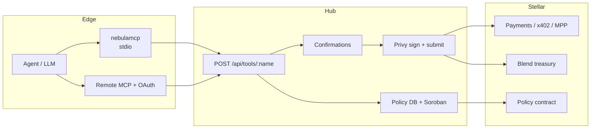

# Architecture

Nebula is a **custody Hub** for AI agents on Stellar. Agents never hold private keys — they authenticate with `nbl_live_…` (or OAuth) and call tools; the Hub enforces policy, signs via Privy, and submits to the network.

## Packages

| Piece | Path | Role |
|-------|------|------|
| Hub | `apps/nebula-hub` | Privy login + custody, Prisma → Supabase, dashboard, `/mcp`, APIs |
| Core | `packages/nebulamcp-core` | Transport-agnostic Zod tools + confirmation matrix |
| Stdio MCP | `packages/nebulamcp` | `nebulamcp` → Hub `/api/tools/*` with `NEBULA_TOKEN` |
| Landing | `apps/landing` | Marketing → built into `nebula-hub/public/landing` |
| Policy | `contracts/policy` | Soroban spend caps / treasury bands |

**Database:** Supabase Postgres. Schema: `apps/nebula-hub/supabase/hub.sql`. Setup: [SUPABASE.md](./SUPABASE.md).

**Rule:** private keys never leave the Hub. Clients present `nbl_live_…` or OAuth only.

## Status

| Piece | Status |
|-------|--------|
| Privy session → Hub user + Stellar wallet | Done |
| Tool pipeline `POST /api/tools/:name` | Done |
| Human approve → Privy sign+submit | Done |
| Policy whitelist / denylist / caps (Hub DB) | Done |
| On-chain policy (`POLICY_CONTRACT_ID` → `check_spend`) | Done when configured |
| Dashboard live data | Done |
| Remote Streamable HTTP MCP + OAuth DCR | Done |
| Blend XLM treasury + activity-triggered auto-yield | Done |
| x402 tools | Done |
| MPP session tools + Hub demo merchant | Done |
| Stellar8004 reputation (Hub provision) | Done — on-chain sync still pending |
| Publish `nebulamcp` / `nebulamcp-core` | In progress |
| Blend USDC + background yield loop | Pending |
| Approval inbox / notify polish | Partial (`await_confirmation` works) |

Env template: `apps/nebula-hub/.env.example`.
